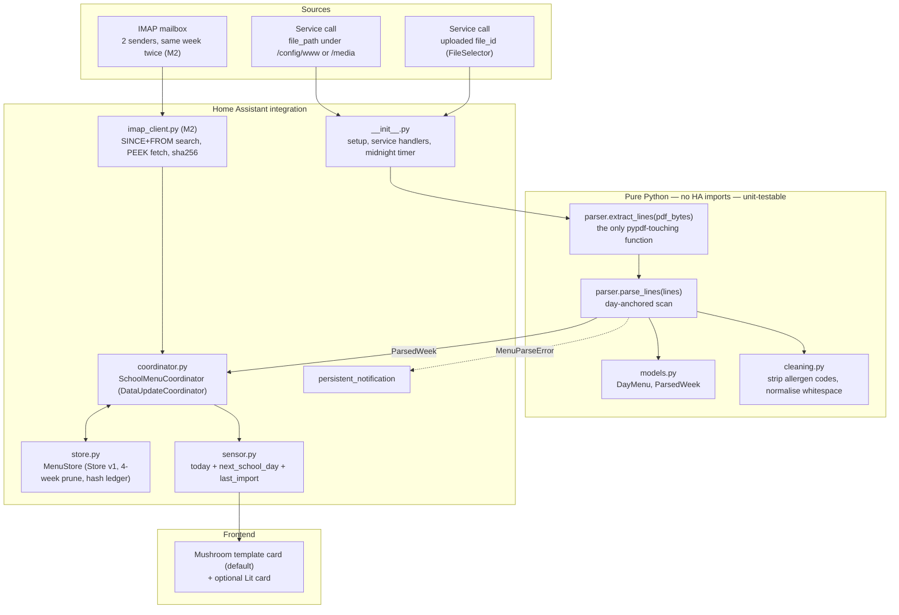
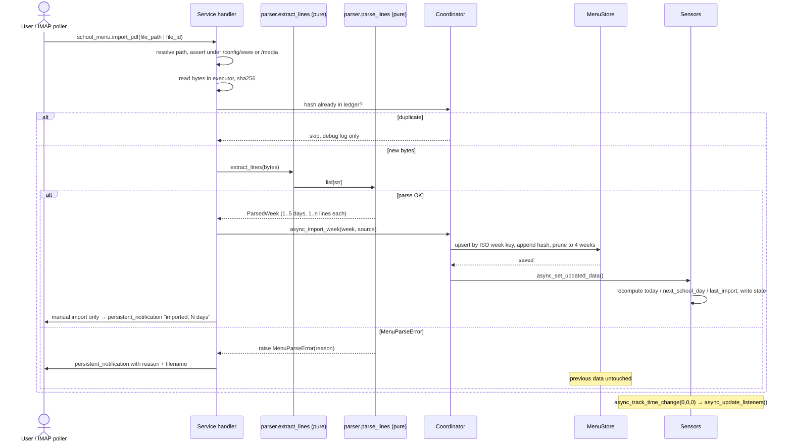

# Design 0002 — `school_menu` technical design

Status: **Draft v2 — amended 2026-09-25 after the design grilling, awaiting approval**
Supersedes v1 of this document · Implements RFC 0001 (approved 2026-09-25)

## 0. Inputs this design is built on

- RFC 0001 decisions D1–D5, plus the two RFC amendments:
  - **Allergen codes are removed and discarded.** No `allergens` attribute, no `*_raw` field.
  - **Line count is lenient.** Take whatever lines appear under a day header; 3 is typical, 2 is valid
    (a day with no salad or no dessert), 1 is valid.
- The 15 grilling resolutions of 2026-09-25, recorded in §10, which are binding on this design.
- Verified against the two real PDFs (`26-39`, `26-40`) and against current HA source, not recall.

### Operational constraints supplied by the operator

| Constraint | Value | What it determines |
|---|---|---|
| Delivery cadence | **One PDF per week**, arriving **Sunday or Monday** for that current/upcoming week. Never a multi-week batch. | Makes "prune to newest 4 weeks" safe (§4.2); sets the 15-minute poll interval as adequate |
| Senders | **Two**: `Maximilian.Stollberg@annie-heuser.schule` and `Lena.Putzmann@annie-heuser.schule` (two children, two class teachers, same school) | Sender filter is a **list**, and the same week arrives **twice** → dedup is a first-class requirement (§5.5) |
| Subject | Contains `Speiseplan KW<XX>`, `XX` = calendar week (German KW = ISO week) | Subject filter, plus a free week-number cross-check and a `fallback_week_start` source (§5.5) |
| Home Assistant core | **2026.9.3** | `hacs.json` floor, `pytest-homeassistant-custom-component` pin, CI matrix |

### API facts verified on 2026-09-25 (post-cutoff drift check)

| Thing | Verified current form |
|---|---|
| Minimum core | **2026.9.3** — declared in `hacs.json`; every API below exists at that version |
| Options flow base | `OptionsFlowWithReload` — auto-reloads on options change, no manual update listener |
| Entity add callback | `AddConfigEntryEntitiesCallback` (not `AddEntitiesCallback`) |
| Service registration | Bronze rule `action-setup`: register in **`async_setup`**, not `async_setup_entry`; handler resolves the entry and raises `ServiceValidationError` if missing or not `ConfigEntryState.LOADED` |
| `Store.__init__` | `(hass, version, key, private=False, *, atomic_writes=False, encoder=None, max_readable_version=None, minor_version=1, read_only=False, serialize_in_event_loop=True)` |
| Migration hook | `async _async_migrate_func(self, old_major_version, old_minor_version, old_data)` |
| File upload | `from homeassistant.components.file_upload import process_uploaded_file` → `@contextmanager ... -> Generator[Path]`, must run in executor |
| Selectors | `file` (requires `accept`), `date` (`config_entry` no longer used — see §10 R2) |

### Facts verified directly against the sample PDFs

- Header date range separator is **EN DASH U+2013** (`e2 80 93`), two-digit year (`28.09.26 – 02.10.26`).
- Days are separated by a blank line; **FREITAG's last line is followed immediately by the quote**
  with no blank line → footer sentinels are required, not defensive padding.
- The allergen legend (`Gluten (1), Weizen (1a) …`) and `Natriumnitrit(a)` sit **below** the first
  sentinel, so the narrow allergen regex never sees them.
- Filename `KW` matches the ISO week on both samples: `2026-09-21` → `2026-W39`, `2026-09-28` → `2026-W40`.
- `2026-12-28` → `2026-W53`, confirming the year-boundary case in §6.

## 1. Component diagram



## 2. Data flow — import and read



## 3. File tree

```
custom_components/school_menu/
├── __init__.py          Setup/unload. Registers import_pdf in async_setup (bronze action-setup).
│                        Owns the midnight async_track_time_change timer.
├── const.py             DOMAIN, storage key/version, defaults, attribute name constants.
├── models.py            Pure dataclasses: DayMenu, ParsedWeek. Frozen, slots. No HA imports.
├── cleaning.py          Pure. Allergen-code stripping, whitespace/hyphenation normalisation.
├── parser.py            Pure. Two seams: extract_lines(pdf_bytes) -> list[str] (only pypdf caller)
│                        and parse_lines(lines, ...) -> ParsedWeek. Raises MenuParseError.
├── store.py             MenuStore: Store wrapper, ISO-week keying, 4-week prune, content-hash
│                        ledger for cross-sender dedup, migration hook.
├── coordinator.py       SchoolMenuCoordinator(DataUpdateCoordinator): in-memory date→DayMenu index,
│                        import entry point, dedup decision, listener fan-out. No parsing, no IO.
├── config_flow.py       ConfigFlow (M1: single step, single entry enforced) + OptionsFlowWithReload
│                        (M2: IMAP host/port/user/pass/folder/senders/subject/interval).
├── sensor.py            SchoolMenuSensor ×2 (today, next_school_day) + LastImportSensor (diagnostic).
│                        Pure projection of coordinator state; CoordinatorEntity subclasses.
├── date_logic.py        Pure. target_date(today, which), weekday naming, week derivation.
├── imap_client.py       (M2) aioimaplib client: connect, SINCE+FROM search, BODY.PEEK fetch,
│                        RFC 2047 subject decode, KW extraction, PDF attachment extraction.
├── diagnostics.py       Redacted config-entry dump (credentials → REDACTED).
├── services.yaml        import_pdf schema: file_path | file_id | week_start. No config_entry_id.
├── strings.json         Source strings for config flow, options, services, exceptions.
├── translations/
│   ├── en.json
│   └── de.json
└── manifest.json        requirements: ["pypdf==6.19.0"], dependencies: ["file_upload"]

tests/
├── conftest.py          hass fixtures, sample-PDF fixtures, frozen-clock helper.
├── fixtures/
│   ├── AHS Speiseplan 26-39.pdf     real sample — covers extract_lines end-to-end
│   └── AHS Speiseplan 26-40.pdf     real sample
├── test_parser.py       extract_lines against the real PDFs; parse_lines against string lists.
├── test_cleaning.py     Allergen stripping, umlauts, whitespace and "/" normalisation.
├── test_date_logic.py   Rollover, Friday→Monday, weekend, DST, year boundary.
├── test_store.py        Upsert/overwrite, hash ledger, 4-week prune, migration.
├── test_config_flow.py  Full coverage (bronze requirement), single-entry abort.
├── test_services.py     file_path, file_id, traversal rejection, entry-not-loaded, parse failure.
├── test_imap.py         (M2) two-sender dedup, subject match, PEEK, KW cross-check.
└── test_sensor.py       State/attributes incl. none-states; last_import; midnight rollover.

.github/workflows/{hassfest,hacs,tests}.yml   ·   .gitignore   ·   hacs.json   ·   README.md   ·   docs/
```

**Why `parser.py`, `cleaning.py`, `models.py`, `date_logic.py` have no HA imports:** they run in plain
pytest with no `hass` fixture, so the parse/format loop is fast, and swapping pypdf for something else
later (RFC risk row) touches `extract_lines` alone.

## 4. Data schemas

### 4.1 Parsed objects (in memory)

```python
@dataclass(frozen=True, slots=True)
class DayMenu:
    date: datetime.date
    lines: tuple[str, ...]  # 1..n cleaned lines, allergen codes removed

    @property
    def main(self) -> str | None:
        return self.lines[0] if len(self.lines) > 0 else None

    @property
    def side(self) -> str | None:
        return self.lines[1] if len(self.lines) > 1 else None

    @property
    def dessert(self) -> str | None:
        return self.lines[2] if len(self.lines) > 2 else None


@dataclass(frozen=True, slots=True)
class ParsedWeek:
    week_start: datetime.date  # Monday, derived from the header range
    days: tuple[DayMenu, ...]  # 1..5, ascending, only days that had content
    source_file: str
    content_hash: str  # sha256 hex of the raw PDF bytes
```

`main`/`side`/`dessert` are **positional accessors, not semantic claims** (RFC finding F1). A day with
two lines yields `main` + `side` and `dessert is None`. A day with four or five lines keeps all of them
in `lines`; the accessors still address positions 1/2/3 (§10 R6).

### 4.2 Storage format — `.storage/school_menu.<entry_id>`, version 1

```jsonc
{
  "version": 1, "minor_version": 1, "key": "school_menu.01J…",
  "data": {
    "weeks": {
      "2026-W40": {
        "week_start":  "2026-09-28",
        "source_file": "AHS Speiseplan 26-40.pdf",
        "content_hashes": ["3f7a…", "b1c9…"],   // one per accepted byte-stream, see §5.5
        "ingested_at": "2026-09-27T18:04:11+02:00",
        "source": "imap",                        // "imap" | "manual"
        "days": {
          "2026-09-28": {"lines": ["Pasta mit Tomaten Sauce dazu Parmesan",
                                   "Blattsalat mit gerösteten Kernen", "Obst"]},
          "2026-09-30": {"lines": ["Chili sin Carne mit Sauer Sahne", "Reis",
                                   "Blattsalat mit gerösteten Kernen"]}
        }
      }
    }
  }
}
```

Keyed by **ISO week** (`GGGG-Www`) so re-importing a week is a dict overwrite and pruning is a sort by
`week_start`, keep newest 4. Days keyed by ISO date. The coordinator flattens this into a
`dict[date, DayMenu]` index on load and after every import — lookups are O(1) and no date maths happens
at sensor-read time. Absent dates are simply absent; there is no "empty day" record (§10 R9).

`content_hashes` is a **list**, not a scalar, because the same week legitimately arrives twice from two
senders and the two attachments may or may not be byte-identical (§5.5).

**Retention:** newest 4 weeks by `week_start` (§10 R4). Safe because at most one future week is ever in
flight. Documented limitation: manually backfilling 5+ future PDFs in one sitting would evict the current
week. A pruned week's hashes are pruned with it, so a re-fetched mail for a week older than 4 weeks would
re-import — impossible in practice, because the IMAP search window is 14 days.

### 4.3 Sensor state and attributes

| | `sensor.school_menu_today` / `_next_school_day` |
|---|---|
| state (menu found) | `main` — cleaned first line, e.g. `Pasta mit Tomaten Sauce dazu Parmesan` |
| state (no menu) | the literal string `none` (§10 R1) |
| `weekday` | German name, e.g. `Montag` (`Samstag`/`Sonntag` on weekends) |
| `date` | ISO date of the day being shown, e.g. `2026-09-28` |
| `main` / `side` / `dessert` | positional lines 1/2/3; `None` when that line does not exist |
| `lines` | full list, the honest representation — holds 4–5 entries if the PDF ever has them |
| `source_file`, `ingested_at` | provenance of the week this day came from |
| `reason` | only when state is `none`: `weekend` or `no_menu` |

| | `sensor.school_menu_last_import` (§10 R15) |
|---|---|
| state | timestamp of the most recent accepted import (`device_class: timestamp`) |
| entity category | `diagnostic` |
| `week` | ISO week key of that import, e.g. `2026-W40` |
| `source_file`, `source` | filename and `imap` \| `manual` |
| `weeks_stored` | how many weeks are currently in the store |

This sensor exists because the sender+subject filter fails silently by design (§10 R14), while holidays
are represented by absence of data — so an alarm on "no menu today" would false-fire through every
Ferien. A visible "Stand: 28.09." on the card carries the staleness signal without claiming that data
*should* exist. No notification is raised for staleness.

`icon: mdi:food` / `mdi:food-fork-drink`. No `device_class`, no `state_class` on the menu sensors — free text.
`_attr_has_entity_name = True`, all three entities on one service-type device so they group in the UI.

**State length:** HA rejects states over 255 chars. Longest real main course is 46. The setter truncates
at 255 with an ellipsis and logs a warning; `attributes["main"]` always carries the untruncated text.

## 5. Interfaces

### 5.1 Parser (pure) — two seams

```python
class MenuParseError(Exception):
    """Raised when a PDF cannot be turned into a usable week."""

    def __init__(self, reason: str, *, detail: str | None = None) -> None: ...


def extract_lines(pdf_bytes: bytes) -> list[str]: ...


def parse_lines(
    lines: list[str],
    *,
    source_file: str,
    content_hash: str,
    fallback_week_start: datetime.date | None = None,
) -> ParsedWeek: ...
```

`extract_lines` is the **only** function that imports pypdf: `PdfReader(BytesIO(...))` → join
`page.extract_text()` → strip → drop blank lines. Empty result → `MenuParseError("no_text_layer")`
(would indicate a scanned PDF). Swapping the PDF library later is confined to this function.

`parse_lines` is pure text, which is what makes every edge case a **string list in the test file**
rather than a binary fixture (§10 R12). Algorithm, in order:

1. Find the header range `DD.MM.YY[YY] [–—-] DD.MM.YY[YY]`. Take the **start date** only and derive the
   other four as `+1..+4` days (year-boundary safe). Two-digit years resolve via `%y` (26 → 2026).
   If the start date is not a Monday, normalise back to that week's Monday and log.
   No header → use `fallback_week_start`; if that is also absent → `MenuParseError("no_date_range")`.
2. Locate day anchors `MONTAG|DIENSTAG|MITTWOCH|DONNERSTAG|FREITAG` as whole uppercase lines, in order.
   Zero anchors → `MenuParseError("no_day_anchors")`. Out-of-order anchors → `MenuParseError("day_order")`.
3. For each anchor, take lines until the next anchor **or until a footer sentinel**, whichever comes first.
   Footer sentinels (required because FREITAG is followed directly by the quote with no blank line):
   a line starting `„`, the exact line `(Änderung Vorbehalten)`, a line starting `Allergene und Zusatzstoffe`,
   `Konservierungsstoff`, or containing `organiced-kitchen`. Hard cap of 5 lines per day as a sanity bound.
4. Clean each line (§5.2). Drop lines that clean to empty.
5. **More than 3 lines for a day:** keep all of them in `lines` and log a `WARNING` naming the day
   (§10 R6). No wrap-merge heuristic — gluing `"mit Sauer Sahne"` onto the previous line would corrupt
   data silently, whereas an extra entry in `lines` loses nothing.
6. Build `DayMenu` only for days with ≥1 line. **A day anchor with 0 lines is omitted** and logged at
   `WARNING` (§10 R9) — that is a day with no lunch, not an error, and it produces no empty-day record.
7. **Validation (lenient, per the RFC amendment):** succeed if ≥1 day has content. Fail only if the week
   is entirely empty → `MenuParseError("no_days_with_content")`.

### 5.2 Cleaning (pure)

```python
def strip_allergen_codes(text: str) -> str: ...
def normalise(text: str) -> str: ...
```

Allergen pattern — deliberately narrow so real parentheses survive:

```python
ALLERGEN_GROUP = re.compile(r"\s*\((?:\d{1,2}[a-e]?)(?:\s*,\s*(?:\d{1,2}[a-e]?))*\)")
```

Matches `(1a, 3)`, `(4)`, `(3, 7)`; does **not** match `(scharf)` or `(vegan)`. Applied globally, then
whitespace collapsed and stray ` /` spacing tidied (`Soja geschnetzeltes /Frische Kräuter` →
`Soja geschnetzeltes / Frische Kräuter`).

### 5.3 Service — `school_menu.import_pdf`

Registered in `async_setup`. Exactly one of `file_path` / `file_id` required. **No `config_entry_id`
field** — the integration allows exactly one entry (§5.4, §10 R2), so the handler resolves it itself.

```yaml
import_pdf:
  fields:
    file_path:
      required: false
      example: /config/www/menus/AHS Speiseplan 26-40.pdf
      selector: {text: null}
    file_id:
      required: false
      selector: {file: {accept: application/pdf,.pdf}}
    week_start:
      required: false          # fallback when the PDF header has no date range
      selector: {date: null}
```

Handler contract:
- Resolve the single entry → `ServiceValidationError` if missing or not `ConfigEntryState.LOADED`.
- Neither/both of `file_path`+`file_id` → `ServiceValidationError`.
- `file_path`: `Path(p).resolve()` (follows symlinks, collapses `..`), then require it to be relative to
  `hass.config.path("www")` or one of `hass.config.media_dirs.values()`. Otherwise `ServiceValidationError`
  — this is the guard that stops the service becoming an arbitrary-file-read primitive.
- `file_id`: `process_uploaded_file(hass, file_id)` inside `hass.async_add_executor_job`.
- All file IO in the executor. Parsing (pure CPU, ~11 ms) also in the executor to keep the loop clean.
- A manual import **always parses**, even if the hash is already known, so that re-importing a file you
  just fixed is never a no-op surprise; the hash ledger still de-duplicates the *stored* result.

### 5.4 Config flow / options flow

**M1 config flow** — one step, no connection to test yet:
`async_step_user` → optional `name` (default `School menu`) → `async_create_entry`.
A **fixed** unique id plus `_abort_if_unique_id_configured` enforces **exactly one entry, ever**
(§10 R2). Entity ids therefore stay `sensor.school_menu_today` / `_next_school_day` / `_last_import`, and the
documented card YAML is copy-pasteable with no placeholders.

**Amendment 2026-09-26 — entity ids are pinned explicitly.** The single-entry rule alone does not fix
the ids: Home Assistant derives them from the device name, i.e. the entry *title*, which the user
types in the config flow. The first live install was titled "AHS Speiseplan" and got
`sensor.ahs_speiseplan_*`, so the documented card showed "Speiseplan nicht verfügbar". Each entity
therefore sets `entity_id = sensor.school_menu_<key>` before registration. HA only honours that for a
new registry entry; an existing install keeps its ids until the entry is re-added or the ids are
renamed in the UI.

**M2 options flow** — `OptionsFlowWithReload`, step `init`:

| Field | Default | Notes |
|---|---|---|
| `host`, `port`, `ssl` | —, `993`, `true` | |
| `username`, `password` | — | written to `entry.data`, never `entry.options` |
| `folder` | `INBOX` | |
| `senders` | `Maximilian.Stollberg@annie-heuser.schule`, `Lena.Putzmann@annie-heuser.schule` | **list**, ≥1 required (§5.5) |
| `subject_filter` | `Speiseplan KW` | case-insensitive substring (§10 R14) |
| `scan_interval_minutes` | `15` (min 5) | mail arrives Sun/Mon, so 15 min is comfortably inside the need |

Credentials are written to **`entry.data`** via `async_update_entry`, never to `entry.options`,
so they stay out of options diffs. Auth failure during polling → `ConfigEntryAuthFailed` → reauth flow.

**Amendment 2026-09-26 — plain `OptionsFlow` plus an explicit reload, and validation.** Because every
field is written to `entry.data`, `entry.options` stays `{}`; `OptionsFlowWithReload` reloads only when
the options change and would therefore never reload. The flow is a plain `OptionsFlow` that calls
`async_schedule_reload` itself. The form rejects: an empty `host`; an empty `senders` list or any
sender that is not an e-mail address; an empty `subject_filter` (it would match every mail); a missing
password when none is stored yet. `senders` stays **≥1**, not exactly two — the two teachers are the
default, not a rule.

### 5.5 IMAP client and deduplication (M2)

**Search.** Per poll, per configured sender:
`SEARCH SINCE <today-14d> FROM "<sender>"`, then union the UID sets. (A single
`(OR FROM "a" FROM "b")` term is equivalent; two searches are used because they are trivially
composable for N senders and avoid server-specific OR quirks.)

**Fetch.** `BODY.PEEK[]` only — the `\Seen` flag is **never** set and no other mailbox state is
modified (§10 R5). HA and your mail client never compete for the same message, and HA being offline
all weekend still picks up Sunday's mail on Monday because the window is date-based, not flag-based.

**Amendment 2026-09-26 — session shape, fetch order and download volume** (M3 review):

- **`EXAMINE`, never `SELECT`.** The folder is opened read-only. `CLOSE` after a read-write `SELECT`
  expunges every `\Deleted` message in the folder — a mailbox mutation R5 forbids. aioimaplib 2.0.1's
  `examine()` does not move its protocol to the `SELECTED` state (only `select()` does), so
  `imap_client.py` ships `ReadOnlyIMAP4` / `ReadOnlyIMAP4SSL`, which fix that state transition.
- **The session is always torn down** — `CLOSE`, `LOGOUT`, then the transport is closed — in a
  `finally`, on success and on every error path. A failed connect (refused, DNS, TLS) surfaces as that
  error, not as a silent 10 s timeout.
- **Timeouts:** 30 s per command, 120 s for the whole poll.
- **SSL context:** `homeassistant.util.ssl.client_context()` (cached), never built on the event loop.
- **Order:** the UID union is processed in **ascending UID order**, i.e. arrival order, so the newest
  mail is applied last. Per-sender order would let a stale forward from teacher B overwrite a
  correction teacher A sent later.
- **Header first.** Each UID is fetched as `BODY.PEEK[HEADER.FIELDS (FROM SUBJECT DATE)]`; the full
  `BODY.PEEK[]` is fetched only for messages that pass the sender and subject filter.
- **Download cache.** A message whose `(UIDVALIDITY, UID)` was already processed in this HA run is not
  downloaded again. This is an in-memory transfer optimisation only; the dedup key stays the content
  hash, and a `UIDVALIDITY` change simply invalidates the cache. When the server reports no
  `UIDVALIDITY`, nothing is cached.
- **LOGIN outcome:** `NO` means bad credentials → reauth. `BAD`, or a `NO` carrying `[UNAVAILABLE]`,
  is a transient failure → `UpdateFailed`.
- **Credential hygiene:** `ImapSettings` hides the password from its `repr`. aioimaplib's own `DEBUG`
  log masks the password only by exact substring, so `aioimaplib` is not listed in the manifest's
  `loggers`, and enabling its debug log is at the operator's own risk.
- **Setup does not wait for the mailbox:** the first poll runs as a background task, so a hung server
  cannot delay HA startup.

**Filter.** A message is a candidate when *all* hold:
1. `From` is one of the configured senders (already guaranteed by the search, re-checked locally).
2. The RFC 2047-decoded `Subject` contains `subject_filter`, case-insensitively (§10 R14).
3. It has at least one `application/pdf` attachment.

**Subject week number.** `re.search(r"Speiseplan\s*KW\s*(\d{1,2})", subject, re.I)` yields the KW.
German KW is the ISO week, so `(iso_year_from_message_date, kw)` gives a Monday. It is used for:
- `fallback_week_start` when the PDF header range is unreadable — which turns RFC finding F3's edge case
  into a recoverable one;
- a **cross-check** against the week parsed from the PDF header. On mismatch: log `WARNING`, import
  anyway, PDF header wins. The header is the authoritative source; the subject is a hint.

**Deduplication.** The same week arrives twice, once per class teacher. Three layers, evaluated in order:

| Layer | Test | Action |
|---|---|---|
| 1 — byte identity | `sha256(attachment)` is already in any stored week's `content_hashes` | Skip before parsing. `DEBUG` log. No store write, no listener update. |
| 2 — content identity | Hash is new, but the parsed `ParsedWeek` has the same week key **and** identical `days` as what is stored | Append the hash to `content_hashes` so layer 1 catches it next time. No listener update. `DEBUG` log. |
| 3 — genuine update | Hash is new and the parsed days differ from what is stored for that week | Overwrite the week, append the hash, update listeners. `INFO` log naming the week and what changed count-wise. |

**Amendment 2026-09-26 — listener updates and the shrink guard.** The coordinator runs with
`always_update=False`, so a poll that only met layers 1 and 2 notifies **no** listener; only layer 3
calls `async_set_updated_data`. Layer 3 has one exception for the **IMAP path only**: when the incoming
week carries a strict subset of the days already stored for that week, it is refused rather than
overwriting — a degraded parse (a day anchor that lost its lines) must not shrink a good week
unattended. The refusal raises the `school_menu_import_error` notification naming the file and reason
`fewer_days`, and the hash is remembered for the rest of the HA run so it is neither re-parsed nor
re-notified every poll. A **manual** `import_pdf` of the same file always overwrites: the operator's
explicit action is how a genuine correction that drops a day (a Studientag) gets in.

Layer 2 is the one that matters: the two teachers may forward or re-attach the file such that the bytes
differ while the menu is identical. Without it, the second mail would rewrite the store and bump
`last_import` for no reason. Message UIDs are deliberately *not* used as the dedup key — they reset on
`UIDVALIDITY` change, whereas the content hash is stable.

**No success notification** for the IMAP path (§10 R8); `INFO` log and the `last_import` sensor carry it.

## 6. Date and time logic (`date_logic.py`, pure)

All "now" comes from `homeassistant.util.dt.now()` (HA-configured tz); the pure module takes a `date`
argument and never calls `datetime.now()` itself — that is what makes it testable without freezing a clock.

```python
def target_date(
    today: datetime.date, which: Literal["today", "next_school_day"]
) -> datetime.date | None
```

- `today`: returns `today` if Mon–Fri, else `None` → state `none`, `reason: weekend`.
- `next_school_day`: returns the **next weekday strictly after `today`** (§10 R3).
  Mon–Thu → `+1`; **Fri → Monday (+3); Sat → Monday (+2); Sun → Monday (+1)**.
  The sensor is therefore never `none` for calendar reasons — only when data is genuinely missing.
  The `date` and `weekday` attributes disambiguate, and the card shows them.

**Week derivation:** header start date → `date.isocalendar()` → `(iso_year, iso_week)` → storage key.
Deriving days 2–5 by offset from the start date rather than by parsing the end date makes a week that
crosses New Year (`28.12.26 – 01.01.27`) correct for free; `2026-12-28` is `2026-W53`.

**Rollover:** `async_track_time_change(hass, _at_midnight, hour=0, minute=0, second=0)`, registered in
`async_setup_entry` and torn down via `entry.async_on_unload`. The callback only calls
`coordinator.async_update_listeners()` — no IO, no refetch. Wall-clock based, so it survives DST
transitions without special handling: verified against HA's own scheduler across both 2026
transitions in Europe/Berlin, it fires exactly once per local calendar date (23 h apart in spring,
25 h in autumn).

**Amendment 2026-09-25 — a timezone change DOES need handling.** v1 of this section claimed the
rollover also survives a tz change in HA settings "without special handling". That was wrong.
`_TrackUTCTimeChange` recomputes its schedule only when it fires and registers no core-config
listener, so after changing the zone both sensors keep the old day until the next (old-zone)
midnight — up to ~24 h, during which `today` can report a school day as a weekend. The entry
therefore also listens for `EVENT_CORE_CONFIG_UPDATE` and refreshes the listeners immediately.

**Coordinator shape (§10 R13):** `SchoolMenuCoordinator` subclasses `DataUpdateCoordinator` from M1 with
`update_interval=None` — no polling in M1, but the listener fan-out, `async_set_updated_data`, and the
`UpdateFailed` / `ConfigEntryAuthFailed` contract §7 relies on come for free. Sensors are
`CoordinatorEntity` subclasses from day one. M2 only sets `update_interval` from the options and fills in
`_async_update_data` with the IMAP poll — no rewrite of `sensor.py`.

## 7. Error handling and notifications

| Situation | Behaviour |
|---|---|
| Parse failure (any `MenuParseError`) | **Stored data untouched.** `persistent_notification.async_create` with the reason key and the filename — **not** the extracted text (amended 2026-09-25, see below). Notification id `school_menu_import_error` so repeats replace rather than pile up. Service raises `HomeAssistantError` so the caller/automation sees it fail. |
| Path outside allowlist, bad args, entry not loaded | `ServiceValidationError` — shown inline in the UI, no notification, not an integration fault. |
| **Manual** import success | `persistent_notification` (id `school_menu_import_ok`, replaced on next success) naming the week and day count. |
| **IMAP** import success | **No notification** (§10 R8). `INFO` log; `sensor.school_menu_last_import` updates. A weekly notification you must dismiss would train you to ignore the failure notifications. |
| Day absent / weekend | **Not an error.** State `none` + `reason`. Never raises, never logs above debug. |
| Day with >3 lines, or a day anchor with 0 lines | **Not an error.** `WARNING` log naming the day; import proceeds (§10 R6, R9). |
| Duplicate mail from the second sender | Layer 1 or 2 of §5.5 → skipped, `DEBUG` log only, no state churn. |
| Subject/sender no longer matches (silent stop) | **No alarm by design.** `last_import` goes stale and is visible on the card (§10 R15); alarming would false-fire through every Ferien. |
| IMAP auth failure (M2) | `ConfigEntryAuthFailed` → HA reauth flow. |
| IMAP transient failure (M2) | `UpdateFailed` → coordinator backs off; notification only after 3 consecutive failures, to avoid nagging on a flaky link. The notification is dismissed on the next successful poll. |
| IMAP attachment that cannot be parsed, or is refused by the shrink guard (M2) | **Per attachment, never per poll:** every other attachment in the same poll is still processed. `school_menu_import_error` notification with filename and reason, once per HA run; the hash is remembered so the next poll neither re-parses nor re-notifies. Any exception out of pypdf on a malformed file counts as a `MenuParseError` (`no_text_layer`). |

**Amendment 2026-09-25 — the notification carries no file content.** v1 of this design said the
parse-failure notification should include "the first 200 chars of extracted text". It must not. The
allowlist validates the path, and the file is opened a moment later in the executor; anyone able to
write into `/config/www` (which Home Assistant also serves unauthenticated at `/local/`) could swap a
symlink in that window. With a content-free notification that race leaks nothing. Echoing 200
characters of whatever was actually opened would turn `import_pdf` into a partial arbitrary-read
oracle. The reason key plus the filename is enough to diagnose a bad PDF; the extracted text goes to
the debug log, which is not world-readable.

**Amendment 2026-09-25 — `file_path` is `required: true` until M2.** §5.3 specifies exactly-one-of
`file_path`/`file_id`. `file_id` (the upload path) is M2 work, so M1 ships `file_path` as required.
The exactly-one-of rule applies once `file_id` exists.

Credentials never appear in logs, notifications, attributes, or diagnostics (`TO_REDACT = {"password", "username"}`).

## 8. Test plan

**Unit — pure, no `hass`:**
- `test_parser.py`
  - `extract_lines`: both real PDFs → the exact expected line sequence (this is the only pypdf coverage).
  - `parse_lines` against **string lists**, not fixture PDFs (§10 R12): a day with 2 lines → `dessert is None`;
    a day with 4 lines → all 4 in `lines`, warning logged, accessors unchanged; a day anchor with 0 lines →
    omitted, no error, warning logged; missing header range with and without `fallback_week_start`;
    non-Monday start date; out-of-order anchors; empty input → `MenuParseError` with the right reason;
    footer never leaks into FREITAG (quote, `(Änderung Vorbehalten)`, allergen legend, contact line).
- `test_cleaning.py`: `(1a, 3)`/`(4)`/`(3, 7)` stripped; `(vegan)`/`(scharf)` preserved; umlauts intact;
  whitespace and `/` spacing normalised; the allergen legend line is *not* mangled if it ever reaches cleaning.
- `test_date_logic.py`: every weekday → correct today/tomorrow target; **Fri/Sat/Sun all → Monday**;
  week crossing New Year; DST-transition days; ISO week at year boundaries (`2026-12-28` is `2026-W53`).

**Integration — with `hass`:**
- `test_config_flow.py`: happy path, **second entry aborts** (single-entry rule), options flow round-trip
  including a two-element `senders` list. Full coverage (bronze).
- `test_services.py`: import via `file_path`; import via `file_id`; path traversal
  (`/config/www/../../etc/passwd`) → `ServiceValidationError`; path outside allowlist → rejected;
  entry-not-loaded → `ServiceValidationError`; parse failure leaves prior data intact **and** raises;
  manual success raises a notification.
- `test_store.py`: overwrite same week; `content_hashes` grows rather than replaces; 4-week prune keeps the
  newest 4 and drops the pruned week's hashes; round-trip through `Store`; migration hook.
- `test_imap.py` (M2): search uses `SINCE` + `FROM` per sender and unions results; fetch uses `BODY.PEEK`
  and asserts `\Seen` is **not** set on the fake server; RFC 2047-encoded subject with umlauts matches;
  `Fwd: Speiseplan KW40` matches the substring filter; wrong sender ignored; **same PDF from both teachers →
  one import, one `last_import` bump** (layer 1); **byte-different but content-identical → no listener
  update** (layer 2); **corrected menu for the same week → overwrite** (layer 3); subject KW disagreeing with
  the PDF header → warning, PDF header wins; wrong password → `ConfigEntryAuthFailed`.
- `test_sensor.py`: states/attributes on a school day, a 2-line day, a 4-line day, a weekend, an unknown
  date; `none` is the literal string; `last_import` timestamp, attributes and diagnostic category;
  midnight rollover flips `today` without a re-import (fire the time-change listener directly).

Fixtures: the two real PDFs committed under `tests/fixtures/`. **No synthetic PDFs** — every edge case is a
string list passed to `parse_lines`, so the cases are readable and diffable in the test file.

## 9. Milestones and acceptance criteria

**M1 — manual ingestion**
- Deliverables: `manifest.json`, `const.py`, `models.py`, `cleaning.py`, `parser.py`, `date_logic.py`,
  `store.py`, `coordinator.py`, `config_flow.py`, `sensor.py` (3 entities), `__init__.py`, `services.yaml`,
  `strings.json`, `translations/{en,de}.json`, `diagnostics.py`, `hacs.json`, tests, README,
  `.github/workflows/{hassfest,hacs,tests}.yml`, `.gitignore`, `git init` + initial commit.
- Accept when: UI setup works with no YAML and a second entry is refused; importing `26-40.pdf` populates
  both sensors correctly for each of Mon–Fri (verified by advancing the clock in tests); weekend → `none`
  with `reason: weekend` on `today` while `tomorrow` shows Monday; unknown date → `none`/`no_menu`;
  a corrupt PDF leaves the previous week intact and raises a notification; the traversal test passes;
  `last_import` reflects the manual import; `hassfest` and `hacs` validation pass on the
  {2026.9.3, latest stable} matrix.

**M2 — IMAP ingestion**
- Deliverables: `imap_client.py`, options flow with the two-sender list, reauth, three-layer dedup,
  subject KW cross-check, tests against a fake IMAP server.
- Accept when: a matching email from **either** teacher results in updated sensors within the configured
  interval (default 15 min) with no manual step; **the second teacher's copy of the same week causes no
  second import and no `last_import` churn**; a re-sent identical PDF is deduped by hash; a non-matching
  sender or subject is ignored; messages are never marked read; wrong password surfaces a reauth prompt
  rather than a stack trace.

**M3 — card**
- Deliverables: Mushroom YAML (documented default), optional Lit card source + build + install steps.
- Accept when: weekday + date, prominent main, side, dessert, tomorrow line, and the `last_import` date as
  a small "Stand: …" line; theme variables only, so light/dark follow the active theme; readable at 400 px;
  weekend/empty shows **"Kein Mittagessen"** (§10 R10).

**Amendment 2026-09-26 — card layout (M4 review).** Mushroom's template card renders `primary` on one
line and truncates it with an ellipsis; only `secondary` wraps (`multiline_secondary`). A 46-character
main such as "Blumenkohl-Brokkoli-Möhre mit Käse überbacken" does not fit in a 400 px tile's primary,
so "prominent main" is realised as **the first line of the wrapping `secondary`**, and `primary`
carries the short day label:

| Tile | `primary` (one line) | `secondary` (wraps) |
|---|---|---|
| today | `Heute · <Wochentag>, <TT.MM.>` | main, then every further line joined by ` · ` — or `Kein Mittagessen` |
| next school day | `Morgen · <Wochentag>, <TT.MM.>` when that day is the next calendar day, else `<Wochentag>, <TT.MM.>` (Fri–Sun → Monday, §10 R3) | main — or `Kein Mittagessen` — then `Stand: <TT.MM.>` |

`Kein Mittagessen` means *the integration is running and there is no lunch* (weekend, holiday, no
menu). When a menu sensor is `unavailable`/`unknown` — the integration is not loaded — the tile says
`Speiseplan nicht verfügbar` instead, and no `Stand:` line is claimed. The documented card is tested
through `Template.async_render_to_info(strict=True)`, the path the `render_template` websocket uses.

## 10. Resolved decisions — design grilling, 2026-09-25

All 15 branches closed. These are binding; §§1–9 above already reflect them.

| # | Branch | Resolution | Lands in |
|---|---|---|---|
| R1 | No-menu sensor state | Literal string `none` (your brief over the HA `unknown` idiom), `reason: weekend\|no_menu` | §4.3 |
| R2 | Config entry count | Exactly one, enforced by fixed unique id; `config_entry_id` removed from the service | §5.3, §5.4 |
| R3 | `tomorrow` on Fri/Sat/Sun | Next weekday — all three resolve to Monday. **Amended 2026-09-26:** the sensor is named for what it is — `sensor.school_menu_next_school_day` ("Next school day"), not `_tomorrow` | §6 |
| R4 | Store retention | Newest 4 weeks by `week_start`, unchanged; safe because ≤1 future week is ever in flight | §4.2 |
| R5 | IMAP selection | `SINCE today-14d` + `FROM <sender>`, `BODY.PEEK[]`, `\Seen` never set | §5.5 |
| R6 | Day with 4–5 lines | Keep all in `lines`, `WARNING` log, no wrap-merge heuristic | §5.1 step 5 |
| R7 | HA version floor | `2026.9.3`; CI matrix {2026.9.3, latest stable} | §0, §9 |
| R8 | Success notification | Manual imports only; IMAP success is an `INFO` log | §7 |
| R9 | Day anchor with 0 lines | Omit, `WARNING` log, `reason: no_menu`; no empty-day record | §5.1 step 6 |
| R10 | Card empty state | German `Kein Mittagessen` | §9 M3 |
| R11 | Repo | `helmerj/HA-Speiseplan`; hassfest + HACS + pytest workflows, `git init` + initial commit; **no** issue/PR templates | §3, §9 M1 |
| R12 | Parser seam | `extract_lines(bytes)` / `parse_lines(lines)`; synthetic cases are string lists, no fixture PDFs | §5.1, §8 |
| R13 | Coordinator | `DataUpdateCoordinator` with `update_interval=None` in M1; `CoordinatorEntity` sensors | §6 |
| R14 | Mail matching | Sender **and** subject both required; subject = case-insensitive substring on the RFC 2047-decoded header | §5.5 |
| R15 | Staleness detection | `sensor.school_menu_last_import` (timestamp, diagnostic) instead of an alarm — holidays are absence of data, so an alarm would false-fire every Ferien | §4.3 |

**Added after the grilling, from the operator's mail setup:** two senders
(`Maximilian.Stollberg@`, `Lena.Putzmann@annie-heuser.schule`) send the same weekly plan, and the subject
carries `Speiseplan KW<XX>`. This makes deduplication a first-class requirement rather than an edge case,
and it is specified as three layers in §5.5: byte identity → content identity → genuine update. The KW in
the subject additionally serves as a `fallback_week_start` source and as a cross-check against the PDF
header, with the header authoritative.

**Nothing is open.** Phase 3 (M1) can start on approval.

**Amendment 2026-09-26 — `tomorrow` renamed to `next_school_day` (R3).** First contact with a live
instance on a Saturday: the entities card showed "Tomorrow: Pasta …" while tomorrow was Sunday. R3's
behaviour (Fri/Sat/Sun → Monday) is kept by the operator's decision; the *name* was the defect. The
sensor is now `sensor.school_menu_next_school_day`, friendly name "Next school day", unique id
`<entry_id>_next_school_day`, and `date_logic.target_date` takes `"next_school_day"`. The card's
"Morgen · …" label already appears only when that day is the next calendar day. Entries created
before the rename keep an orphaned `sensor.school_menu_tomorrow` in the registry, to be removed by
hand — acceptable pre-release, with one known test install.

**Amendment 2026-09-26 — from the first live Gmail run.**

- **A rejected LOGIN names the server's reason.** Gmail answered a mistyped app password with
  `NO [AUTHENTICATIONFAILED] Invalid credentials (Failure)`, but the log said only `NO`, which left the
  operator guessing. `ImapAuthError` / `ImapTransportError` now carry the server's response text,
  truncated to 200 characters, with the configured username and password replaced by `***` in case a
  server echoes them. §7's "credentials never appear in logs" still holds.
- **Removing the entry removes its store.** `async_remove_entry` deletes `.storage/school_menu.<entry_id>`.
  Before this, deleting and re-adding the integration (as the entity-id fix requires) left the old
  week file behind for ever.

**Amendment 2026-09-26 — the next-school-day tile shows every line.** The §9 card table gave the
next-school-day tile the main course only. On the live dashboard that read as data loss ("Blattsalat
mit gerösteten Kernen" and "Obst" missing for Monday, although both are stored). The tile now renders
like today's: the main, then every further line joined by ` · `, then `Stand: <TT.MM.>`.

**Amendment 2026-09-26 — card header.** The card opens with a `custom:mushroom-title-card` reading
"AHS Speiseplan" (operator request), above the today and next-school-day tiles.

